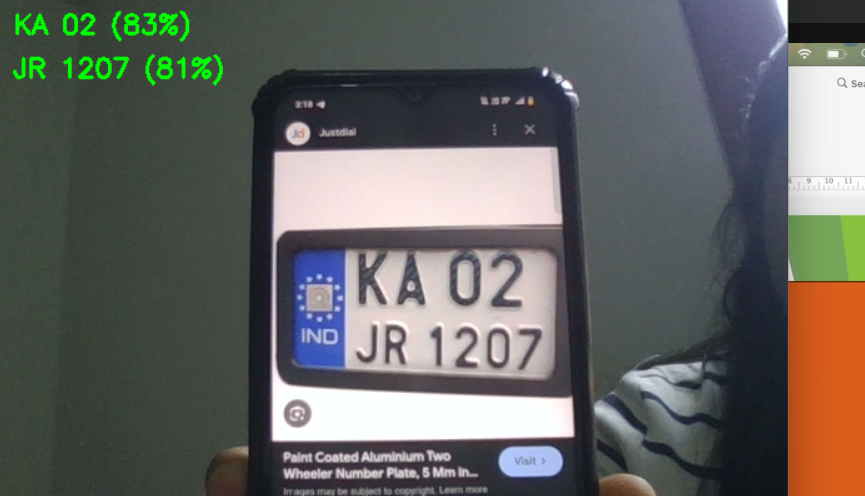
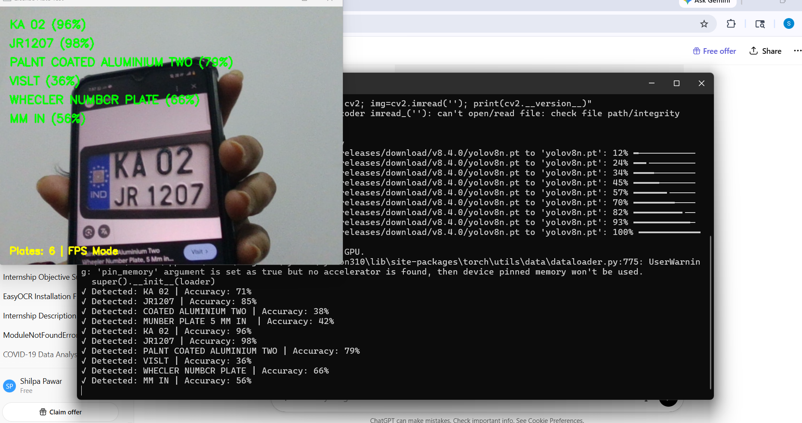

# yolo-object-detection
This project performs real-time object detection using YOLOv8 and OpenCV. It detects vehicles and objects from live camera feed.

## 🛠️ Tech Stack
- Python
- YOLOv8
- OpenCV

## ▶️ Output
 

 
